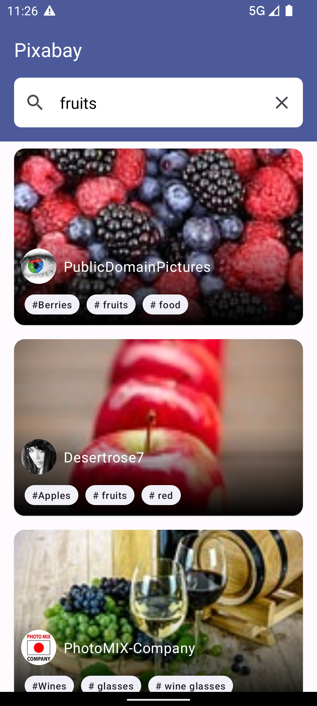
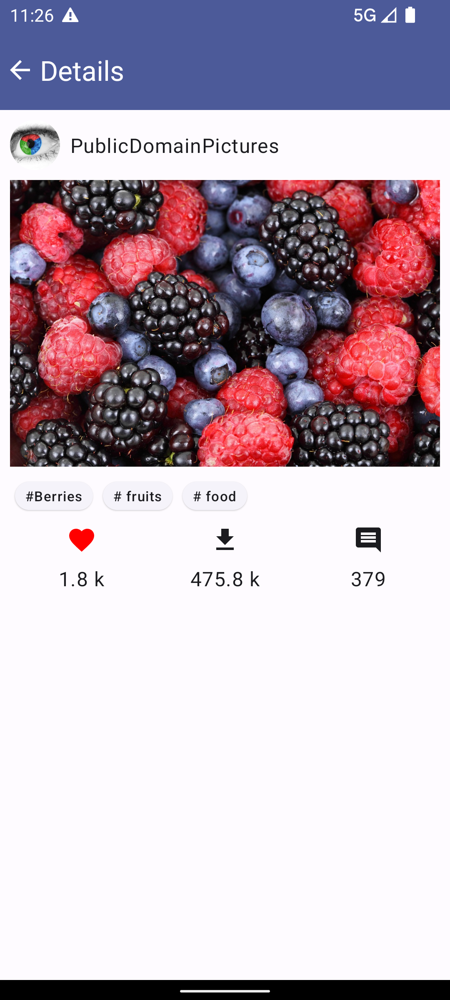

# Pixabay Search Images

## Steps
Before running the project please generate your API KEY at **https://pixabay.com/api/docs/** and replace in **gradle.properties** file.

## Business Requirement
Business Requirement -

* Fetch list of images from Pixabay REST api
* Search images using a specific key
* Show details for selected image

## Project Specification

Project is developed using MVVM clean architecture in Kotlin language. App is getting image data from Pixabay Rest API and populating on UI.
App is following Offline first architecture with retrofit cache. For network calls Coroutine and flow have been used for background thread operations.
For UI creation it's using compose and to update UI it's using kotlin state flow.

## Libraries Used

* Retrofit
* Hilt
* Mockk
* Coroutine
* Coil
* Timber
* ViewModel
* LeakCanary

## Improvements/ Not Implemented
* UI/UX improvements - Since no official  figma design was available so UI/UX can be improved
* Include Localisation for more languages
* Swipe to refresh
* Local DB cache refresh based on business requirement
* UI test cases
* Base classes or Interfaces could be used for Generic functionality for scalability e.g. BaseUseCase

## App Screenshots
    
  
  
  
 

